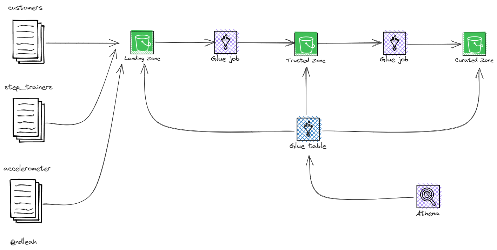
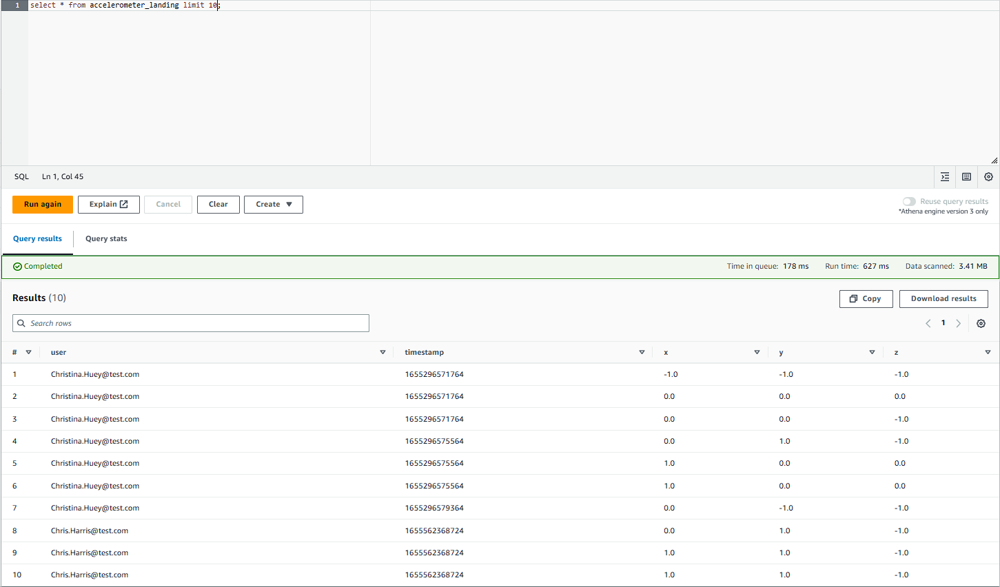
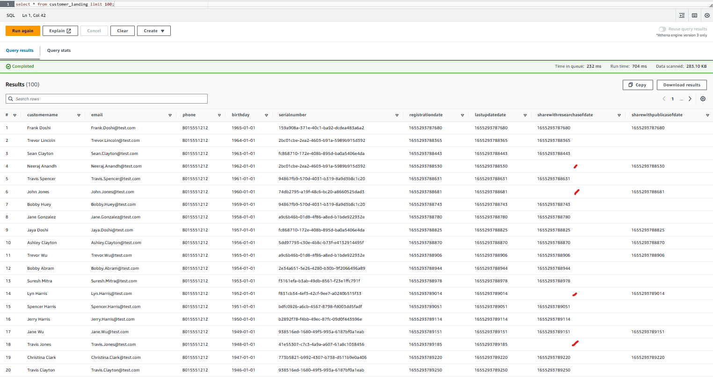

# STEDI - Data Lakehouse 

 

## Introduction
In this project, a data lake solution will be developed using AWS Glue, AWS S3, Python, and Spark for sensor data that trains machine learning algorithms.

AWS infrastructure will be used to create storage zones (landing, trusted and curated), data catalog, data transformations between zones and queries in semi-structured data.

Datasets

* **Customer Records** - from fulfillment and the STEDI website
* **Step Trainer Records** - data from the motion sensor
* **Accelerometer Records** - from the mobile app

Required Steps

* **`Data Acquisition`**: AWS S3 directories were created to simulate data coming from various sources. These directories served as landing zones for customer, step trainer, and accelerometer data.

* **`Data Sanitization`**: AWS Glue Studio jobs were written to sanitize customer and accelerometer data from their respective landing zones. The sanitized data was then stored in a trusted zone.

* **`Data Verification`**: AWS Athena was used to query and verify the data in the Glue customer_trusted table.

* **`Data Curation`**: Additional Glue jobs were written to further sanitize the customer data and create a curated zone that only included customers who have accelerometer data and agreed to share their data for research.

* **`Data Streaming`**: Glue Studio jobs were created to read the Step Trainer IoT data stream and populate a trusted zone Glue table.

* **`Data Aggregation`**: Lastly, an aggregated table was created that matched Step Trainer readings and the associated accelerometer reading data for the same timestamp.

## Implementation

Landing Zone

> In the Landing Zone were stored the customer, accelerometer and step trainer raw data.

[1. customer_landing.sql](DDL/customer_landing.sql)

[2. accelerometer_landing.sql](DDL/accelerometer_landing.sql)

Trusted Zone

> In the Trusted Zone were stored the tables that contain the records from customers who **agreed to share their data for research purposes.**

[1. customer_landing_to_trusted.py](src/customer_landing_to_trusted.py) - script used to build the **customer_trusted table, which contains customer records from customers who agreed to share their data for research purposes.

[2. accelerometer_landing_to_trusted.py](src/accelerometer_landing_to_trusted.py) - script used to build the accelerometer_trusted table, which contains accelerometer records from customers who agreed to share their data for research purposes.

The customer_trusted table was queried in Athena to show that it only contains customer records from people who agreed to share their data.

[customer_trusted](assets/screenshots/customer_trusted.png)

Curated Zone

> In the Curated Zone were stored the tables that contain the correct serial numbers.

**Glue job scripts**

[customer_trusted_to_curated.py](src/customer_trusted_to_curated.py) - script used to build the customer_curated table, which contains customers who have accelerometer data and have agreed to share their data for research.

[step_trainer_trusted_to_curated.py](src/step_trainer_landing_to_trusted.py): script used to build the machine_learning_curated table, which contains each of the step trainer readings, and the associated accelerometer reading data for the same timestamp, but only for customers who have agreed to share their data.

